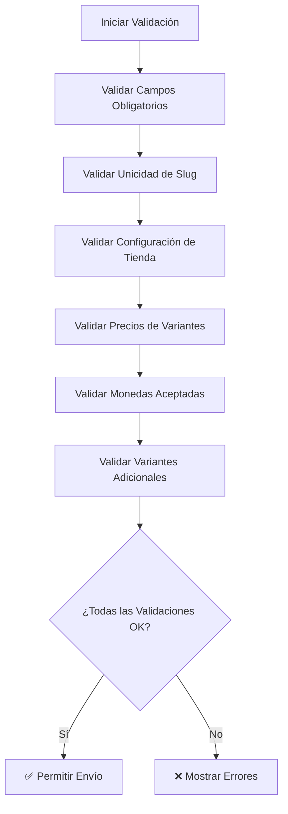

# ✅ Validaciones de Productos - ACTUALIZADAS

## 📋 Resumen de Cambios Implementados

Se han implementado **validaciones avanzadas** para precios y configuración de monedas en el sistema de productos. Las nuevas validaciones garantizan que cada variante tenga precios válidos y que las monedas estén correctamente configuradas.

---

## 🎯 **Nuevas Validaciones Implementadas**

### 1. **Precios Válidos (>= 0 o null)** ✅
- **Regla:** Un precio es válido si es `>= 0` O `null` (pero no `undefined`)
- **Casos válidos:** `0`, `10.50`, `null`
- **Casos inválidos:** `-5`, `undefined`
- **Mensaje:** "El precio debe ser mayor o igual a 0"

```typescript
const isValidPrice = (price: number | null | undefined): boolean => {
  return price === null || (typeof price === 'number' && price >= 0)
}
```

---

### 2. **Cada Variante con Precio Válido** ✅
- **Regla:** Cada variante debe tener al menos un precio válido y no nulo
- **Mensaje:** "La variante '{nombre}' debe tener al menos un precio válido y no nulo"

```typescript
const validPrices = variant.prices.filter(price => 
  price.currencyId && 
  price.currencyId.trim() !== "" && 
  isValidPrice(price.price) && 
  price.price !== null
)

if (validPrices.length === 0) {
  // Error: variante sin precio válido
}
```

---

### 3. **Precio para Moneda por Defecto** ✅
- **Regla:** Si `shopSettings.defaultCurrencyId` existe, cada variante debe tener precio para esa moneda
- **Mensaje:** "La variante '{nombre}' debe tener un precio para la moneda por defecto"
- **Mensaje 2:** "La variante '{nombre}' debe tener un precio válido y no nulo para la moneda por defecto"

```typescript
if (defaultCurrencyId) {
  const defaultPrice = variant.prices.find(p => p.currencyId === defaultCurrencyId)
  
  if (!defaultPrice) {
    // Error: no hay precio para moneda por defecto
  } else if (!isValidPrice(defaultPrice.price) || defaultPrice.price === null) {
    // Error: precio inválido para moneda por defecto
  }
}
```

---

### 4. **Monedas Aceptadas** ✅
- **Regla:** Los precios solo pueden usar monedas de `shopSettings.acceptedCurrencies`
- **Mensaje:** "La moneda '{currencyId}' no está aceptada en esta tienda"

```typescript
const acceptedCurrencyIds = shopSettings[0]?.acceptedCurrencies?.map(c => c.id) || []

variant.prices?.forEach((price, priceIndex) => {
  if (price.currencyId && !acceptedCurrencyIds.includes(price.currencyId)) {
    // Error: moneda no aceptada
  }
})
```

---

### 5. **Configuración de Tienda** ✅
- **Regla:** La tienda debe tener al menos una moneda aceptada configurada
- **Mensaje:** "Debe configurar al menos una moneda aceptada en la tienda"
- **Nota:** `defaultCurrencyId` puede ser nulo (no se valida)

```typescript
if (!shop.acceptedCurrencies || shop.acceptedCurrencies.length === 0) {
  // Error: no hay monedas aceptadas
}
```

---

## 📊 **Comparación: Antes vs Después**

| Validación | Antes | Después |
|------------|-------|---------|
| Precio válido | `> 0` | `>= 0` O `null` |
| Cada variante con precio | ❌ | ✅ |
| Precio para moneda por defecto | ❌ | ✅ |
| Monedas aceptadas | ❌ | ✅ |
| Configuración de tienda | ❌ | ✅ |
| Valores nulos válidos | ❌ | ✅ |

---

## 🔧 **Archivos Modificados**

### 1. **Hook de Validación Actualizado**
**Archivo:** `app/(dashboard)/products/_hooks/useProductValidation.ts`

**Nuevas funciones:**
- `isValidPrice()` - Valida si un precio es válido
- `validateVariantsPrices()` - Valida precios de cada variante
- `validateShopCurrency()` - Valida configuración de la tienda
- `validateCurrencyAcceptance()` - Valida monedas aceptadas

**Función principal actualizada:**
```typescript
const validateProduct = (
  formData,
  variants,
  existingProducts,
  currentProductId,
  shopSettings // ← NUEVO PARÁMETRO
)
```

### 2. **Componentes Actualizados**

#### ✅ Crear Producto
**Archivo:** `app/(dashboard)/products/(singleProduct)/new/page.tsx`
```typescript
const { products, shopSettings } = useMainStore.getState()
const isValid = validateProductWithToast(
  formData,
  variants,
  products,
  undefined,
  shopSettings // ← NUEVO PARÁMETRO
)
```

#### ✅ Editar Producto
**Archivo:** `app/(dashboard)/products/(singleProduct)/[id]/edit/page.tsx`
```typescript
const { products, shopSettings } = useMainStore.getState()
const isValid = validateProductWithToast(
  formData,
  variants,
  products,
  resolvedParams.id,
  shopSettings // ← NUEVO PARÁMETRO
)
```

#### ✅ Edición Rápida
**Archivo:** `app/(dashboard)/products/_components/QuickEditDialog.tsx`
```typescript
const { products, shopSettings } = useMainStore.getState()
const isValid = validateProductWithToast(
  formData,
  formData.variants || [],
  products,
  product.id,
  shopSettings // ← NUEVO PARÁMETRO
)
```

---

## 🎨 **Casos de Uso**

### **Caso 1: Precio Válido**
```typescript
// ✅ Válidos
price: 0        // Precio gratuito
price: 10.50    // Precio normal
price: null     // Sin precio (válido)

// ❌ Inválidos
price: -5       // Precio negativo
price: undefined // Precio no definido
```

### **Caso 2: Variante con Precios**
```typescript
// ✅ Válido: Al menos un precio válido y no nulo
variants: [
  {
    title: "Talla M",
    prices: [
      { currencyId: "usd", price: 25.99 },  // Válido
      { currencyId: "eur", price: null }    // Válido (null)
    ]
  }
]

// ❌ Inválido: Sin precios válidos
variants: [
  {
    title: "Talla M",
    prices: [
      { currencyId: "usd", price: null },   // No válido (null)
      { currencyId: "eur", price: -5 }      // No válido (negativo)
    ]
  }
]
```

### **Caso 3: Moneda por Defecto**
```typescript
// Si shopSettings.defaultCurrencyId = "usd"
// ✅ Válido: Tiene precio para USD
prices: [
  { currencyId: "usd", price: 25.99 },  // Precio para moneda por defecto
  { currencyId: "eur", price: 23.50 }
]

// ❌ Inválido: No tiene precio para USD
prices: [
  { currencyId: "eur", price: 23.50 }  // Solo EUR, falta USD
]
```

---

## 🚨 **Mensajes de Error**

| Error | Mensaje |
|-------|---------|
| Sin precios | "La variante '{nombre}' debe tener al menos un precio" |
| Sin precio válido | "La variante '{nombre}' debe tener al menos un precio válido y no nulo" |
| Sin precio para moneda por defecto | "La variante '{nombre}' debe tener un precio para la moneda por defecto (usd)" |
| Precio inválido para moneda por defecto | "La variante '{nombre}' debe tener un precio válido y no nulo para la moneda por defecto" |
| Precio negativo | "El precio X de la variante '{nombre}' debe ser mayor o igual a 0" |
| Moneda no aceptada | "La moneda '{currencyId}' no está aceptada en esta tienda" |
| Sin monedas aceptadas | "Debe configurar al menos una moneda aceptada en la tienda" |

---

## 🔄 **Flujo de Validación**



---

## 📝 **Valores Nulos Válidos**

Estos campos pueden ser `null` sin error:
- ✅ `variant.sku` (opcional)
- ✅ `variant.weightValue` (opcional)
- ✅ `variant.inventoryQuantity` (puede ser 0)
- ✅ `product.vendor` (opcional)
- ✅ `product.description` (opcional)
- ✅ `product.metaTitle` (opcional)
- ✅ `product.metaDescription` (opcional)
- ✅ `price.price` (puede ser null si hay otros precios válidos)

---

## 🎯 **Beneficios de las Nuevas Validaciones**

### ✅ **Para el Usuario:**
- **Prevención de errores:** No puede crear productos sin precios válidos
- **Mensajes claros:** Sabe exactamente qué corregir
- **Flexibilidad:** Puede usar precios nulos cuando sea apropiado

### ✅ **Para el Sistema:**
- **Integridad de datos:** Garantiza que todos los productos tengan precios válidos
- **Configuración correcta:** Verifica que la tienda esté bien configurada
- **Monedas consistentes:** Solo permite monedas aceptadas por la tienda

### ✅ **Para el Negocio:**
- **Productos completos:** No se pueden crear productos sin precios
- **Configuración de tienda:** Obliga a configurar monedas antes de crear productos
- **Flexibilidad de precios:** Permite precios nulos para casos especiales

---

## 🔧 **Mantenimiento**

### **Agregar Nueva Validación:**
1. Crear función en `useProductValidation.ts`
2. Agregarla a `validateProduct()`
3. Actualizar documentación

### **Modificar Reglas de Precio:**
1. Actualizar `isValidPrice()`
2. Actualizar `validateVariantsPrices()`
3. Probar casos edge

### **Agregar Nueva Moneda:**
1. Configurar en `shopSettings.acceptedCurrencies`
2. Las validaciones se aplicarán automáticamente

---

## ✅ **Checklist de Implementación**

- [x] Hook de validación actualizado con nuevas reglas
- [x] Función `isValidPrice()` implementada
- [x] Validación de cada variante con precio válido
- [x] Validación de precio para moneda por defecto
- [x] Validación de monedas aceptadas
- [x] Validación de configuración de tienda
- [x] Actualizado en página de crear
- [x] Actualizado en página de editar
- [x] Actualizado en diálogo de edición rápida
- [x] Sin errores de linting
- [x] Documentación actualizada

---

**Fecha de actualización:** Octubre 22, 2025  
**Versión:** 2.0 - Validaciones Avanzadas de Precios  
**Autor:** Sistema de validaciones para productos e-commerce

